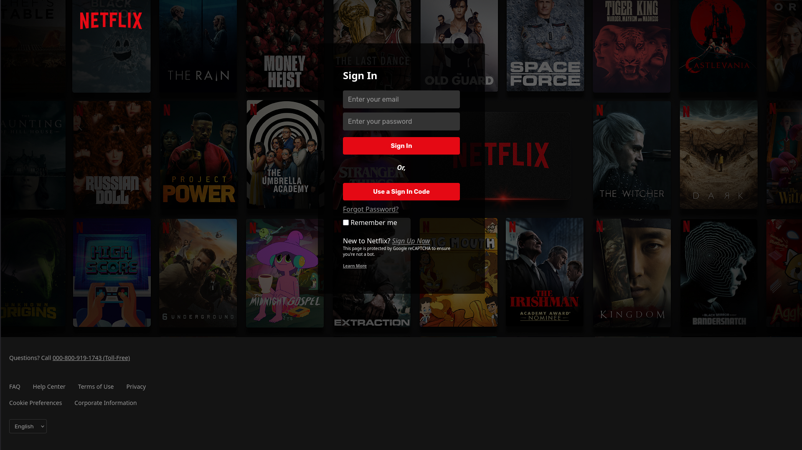

# Netflix Login Frontend

A **Netflix-style login page** built with **HTML and CSS**.  
This project is for **learning and practice** purposes, focusing on front-end design.

---

## 🔗 Live Demo
You can view a live preview here:  
[Live Demo URL](https://0909k.netlify.app/)  



---

## 🛠 Features
- Responsive **login form** with email and password inputs
- "Sign In" and "Use a Sign In Code" buttons
- "Forgot Password?" and "Sign Up" links
- Semi-transparent login card over a background image
- Footer similar to Netflix with multiple links and language selector

---

## 📁 Project Structure
Netflix_Login_Frontend/
│
├─ Assets/ # Images and icons used in the project
├─ index.html # Main HTML file
├─ style.css # Styling for the page
└─ README.md # 


## ⚡ How to Run Locally
1. Clone the repo:
```bash
git clone https://github.com/Lumacodes/Netflix_Login_Frontend.git
